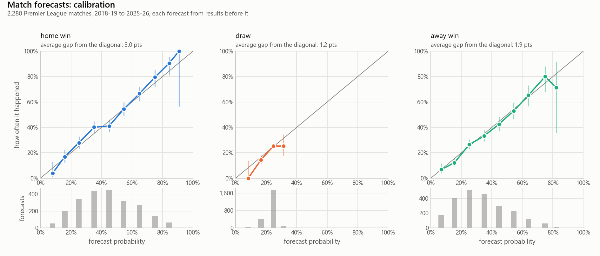
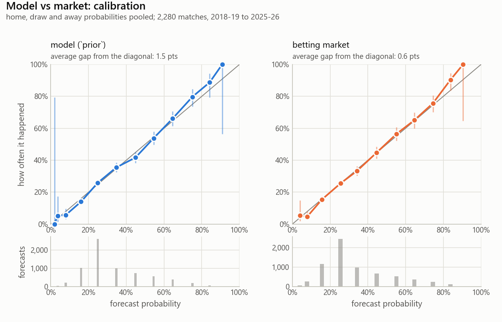
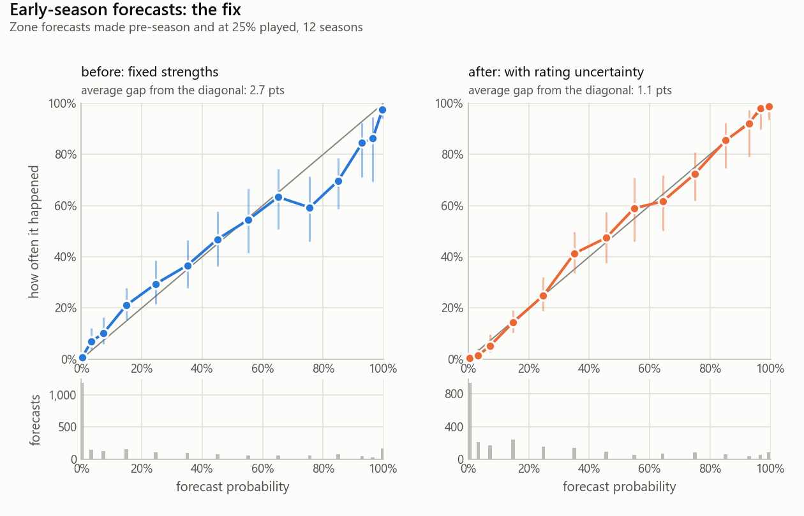
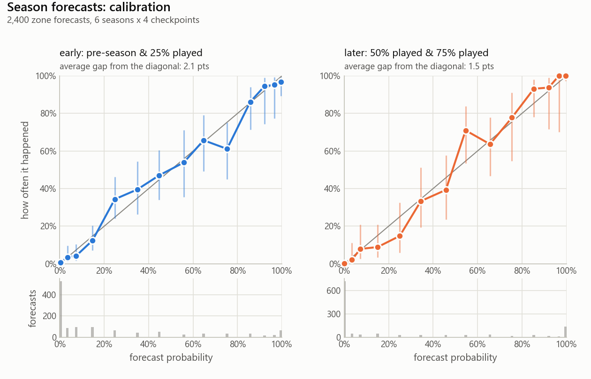

# TableTalk

Probabilistic football forecasting: a Dixon-Coles match model feeding configurable
competition simulators, producing the kind of numbers newspapers print as
"supercomputer predicts the title race" — but with the method written down, the
assumptions flagged, and the forecasts checked against what actually happened.

**Status: Phase 1 complete.** Data layer, Dixon-Coles match model, league
simulator (with rating uncertainty) and both backtests (match-level and
season-level, with calibration) are done and tested for the Premier League. The headline results are
[below](#results-does-it-work-phase-1-done); Phase 2 adds the other big leagues.

```
python -m tabletalk competitions                         # what is configured
python -m tabletalk data fetch --competition premier_league --refresh
python -m tabletalk data check --competition premier_league
python -m tabletalk ratings    --competition premier_league   # fitted ratings + next fixtures
python -m tabletalk evaluate   --competition premier_league   # match-level backtest
python -m tabletalk simulate   --competition premier_league   # title / top-four / relegation odds
python -m tabletalk simulate   --competition premier_league --table                 # projected final table
python -m tabletalk simulate   --competition premier_league --season 2025-26 --as-of 2026-01-01   # replay a past season
python -m tabletalk evaluate-seasons --competition premier_league                   # season-level backtest
python -m tabletalk benchmark  --competition premier_league   # model vs bookmakers' closing odds
python -m tabletalk tune       --competition premier_league   # choose half-life / ridge sd on the tuning seasons
```

The results notebook, [notebooks/premier_league_results.ipynb](notebooks/premier_league_results.ipynb),
puts current predictions, ratings, both backtests and the calibration charts in one place.

---

## Why this architecture

Every competition is a different game — 20 teams playing 38 matches, 18 teams with
a relegation play-off, 36 teams playing 8 different opponents and then a knockout
bracket. The temptation is to write "the Premier League model" and then copy-paste
it. Instead there are three layers that know as little about each other as possible:

| Layer | Question it answers | Knows nothing about |
|---|---|---|
| **Match model** (`tabletalk.model`) | Given these two teams and this venue, how likely is every scoreline? | Tables, brackets, points |
| **Competition simulators** (`tabletalk.simulation`) | Given a format and a match model, what happens if the season is played 10,000 times? | How match probabilities are produced |
| **Competition configs** (`configs/competitions/*.yaml`) | What are this competition's rules? | Python |

The test of the design is Phase 2: adding La Liga should be a new config file, not
a new code path. If it is not, the design is wrong and gets fixed rather than
worked around.

**No competition facts in code.** "20 teams", "38 matches", "top four qualify",
"goal difference before head-to-head" all live in the config. The Python only
knows *kinds* of rules: it can apply a list of tiebreakers drawn from a fixed
vocabulary, and report the probability of finishing inside an arbitrary set of
positions. Config values are validated at load time
([src/tabletalk/config.py](src/tabletalk/config.py)), so a typo is a clear error
rather than plausible-looking wrong output.

### Why Dixon-Coles rather than Elo or gradient boosting

- **Elo** rates team strength on one axis and predicts match outcomes, but it does
  not produce *scorelines*. Simulating a league needs goals, because goal
  difference decides positions, so a goal-level model is the natural fit.
- **Gradient boosting** on match features can be very good at predicting
  home/draw/away, but with a few thousand rows and no injury/lineup/xG feed it
  mostly rediscovers "who is better", while being far harder to explain and far
  easier to overfit.
- **Dixon-Coles** is a small, interpretable generative model: every team has an
  attack and a defence parameter, plus one league-wide home-advantage term. That
  gives a full distribution over scorelines, which is exactly what a simulator
  consumes, and every parameter means something you can say out loud
  ("Arsenal's attack is 1.4x the league average").

The trade-off is honest: Dixon-Coles knows nothing about injuries, transfers,
managerial changes or fixture congestion, and treats a team's strength as slowly
varying. See [Known limitations](#known-limitations).

### How the match model works (plain English)

1. Each team gets two numbers: an **attack** strength and a **defence** strength.
   One league-wide **home advantage** term is added on top.
2. Expected goals for each side come from those numbers:

   ```
   log(home xG) = intercept + home_advantage + attack[home] - defence[away]
   log(away xG) = intercept                  + attack[away] - defence[home]
   ```

   Ratings are on a log scale, so they read as multipliers: an attack of +0.24 means
   `exp(0.24) = 1.27`, i.e. 27% more goals than an average team. Goals are then
   (nearly) Poisson around those expectations.
3. Real football has more 0-0s and 1-1s, and fewer 1-0s and 0-1s, than independent
   Poisson draws predict. Dixon and Coles (1997) fix this with one parameter,
   **rho**, that reweights exactly those four scorelines, and the adjustments
   cancel so probabilities still sum to one. This is what makes it Dixon-Coles
   rather than "two Poissons".
4. Parameters are fitted by **maximum likelihood with time decay**: a match's weight
   halves every 365 days, so recent form counts more. A weak Gaussian prior on each
   rating (worth less than one match of data) keeps the fit well-posed, and is also
   the hook for handling promoted teams.
5. For a **neutral venue** (a cup final) the home-advantage term is dropped.

Fitted to the Premier League as of September 2026: home advantage **+0.17** (home
sides score ×1.18), rho **−0.08**, an average team scores 1.19 away from home.
How much those numbers move from season to season is covered under
[validation](#what-the-data-says-about-the-parameters). The implementation is in
[src/tabletalk/model/dixon_coles.py](src/tabletalk/model/dixon_coles.py), with the
gradient derived in the code comments.

---

## Repository layout

```
configs/
  competitions/premier_league.yaml   # one file per competition: rules, zones, data sources
  team_aliases.yaml                  # canonical team names + every source's spelling
  points_deductions.yaml             # official points deductions, dated, with sources
src/tabletalk/
  config.py             # typed, validated view of a competition config
  paths.py              # where configs and data live
  cli.py, __main__.py   # `python -m tabletalk ...`
  data/
    schema.py           # THE match schema every source must produce
    seasons.py          # season labels ("2025-26") and source-specific codes
    normalise.py        # team-name normalisation
    loaders/
      base.py               # MatchLoader interface
      football_data_uk.py   # results
      openfootball.py       # published fixture lists
    fixtures.py         # the remaining fixtures; checking a schedule against the config
    reconcile.py        # merging results with the published fixture list
    dataset.py          # assemble, filter and summarise a competition's matches
    deductions.py       # points deductions from configs/points_deductions.yaml
  model/
    dixon_coles.py      # likelihood, analytic gradient, fitting, predictions
    promoted.py         # promoted-team strategies: prior / second_tier / none
  evaluation/
    metrics.py          # log loss, Brier score, ranked probability score
    backtest.py         # rolling-origin match-level backtest vs a base-rate baseline
    market.py           # bookmaker odds -> probabilities; model vs market benchmark
    tuning.py           # grid search on the tuning seasons only
    season_backtest.py  # replay past seasons from checkpoints; zone and position scores
    calibration.py      # reliability tables with Wilson intervals
    plots.py            # calibration and probability charts, light and dark
  simulation/
    table.py            # league tables and the config-driven tiebreaker engine
    league.py           # LeagueSimulator: 10,000 seasons, zone probabilities
                        # (KnockoutSimulator arrives in Phase 3)
notebooks/              # results notebook (executed, outputs included)
reports/figures/        # charts used in this README
tests/                  # pytest; runs offline
data/raw/               # untouched downloads (gitignored)
data/processed/         # assembled standard-schema CSVs (gitignored, rebuilt on demand)
```

## The data layer (Phase 1, done)

**One schema, whatever the source** — `date, competition, season, home_team,
away_team, home_goals, away_goals, neutral, played`. A loader's only job is to
produce that frame; nothing downstream knows where a row came from. Validation is
strict and noisy on purpose (missing values, scores on unplayed fixtures, teams
playing themselves, duplicate fixtures, negative goals) because a quietly mangled
column would show up as plausible but wrong probabilities.

Played results and future fixtures live in the same frame, distinguished by
`played`: the model fits on the played rows, the simulator fills in the rest.

**Results source: [football-data.co.uk](https://www.football-data.co.uk/)** — free,
no API key, one CSV per league-season with a stable layout going back to the 1990s,
updated during the season, and it covers every league in Phase 1 and 2.

**Fixture source: [openfootball/football.json](https://github.com/openfootball/football.json)** —
free, no API key, public-domain data, versioned in git (so a run can be pinned to a
commit and reproduced), one JSON file per league-season with full club names, and
complete dated schedules for all five leagues in scope. The alternative considered
was fixturedownload.com, which also publishes full-season CSVs and is a reasonable
fallback, but it is one site's export with no stated licence or history.
openfootball is community-maintained, so its own scores can lag; TableTalk uses it
for the schedule only.

Currently loaded: Premier League 2010-11 to 2026-27 — 6,130 results plus the
complete 2026-27 schedule (50 played, 330 to come, through 2027-05-30) — and 8,927
Championship results over the same seasons as `context` data (see
[Promoted teams](#promoted-teams)). The long history is there for the backtests
and the promoted-team prior; time decay means the current ratings rest almost
entirely on the last two seasons.

A third source role, **`context`**, carries results from a *related* competition
that the match model may learn from but that is never tabulated, simulated or
checked against the schedule. The Championship feeds the model this way without a
single Championship row reaching the Premier League's tables.

**Team-name normalisation** — sources spell clubs differently ("Man United",
"Manchester Utd", "Manchester United FC"). Unreconciled, that silently splits one
club into several weaker teams. Names are resolved through
`configs/team_aliases.yaml` in two steps: a fingerprint (lower-case, accents and
punctuation stripped, club suffixes like "FC"/"AFC" dropped) that handles most
variation for free, then explicit aliases for the rest ("Spurs" is not a
fingerprint of "Tottenham Hotspur"). There is deliberately **no fuzzy fallback** —
an unknown name raises, listing close matches, so the fix is one line in the alias
file. `python -m tabletalk data check` reports all unknown names at once.

**Remaining fixtures come from the published fixture list.** Data sources carry a
role: `results` (authoritative for scores) or `fixtures` (authoritative for the
schedule). The two are reconciled on `(season, home team, away team)` rather than on
the date, because dates move — postponements, TV rescheduling — while the pairing
does not. Played matches keep the results source's score and gain the fixture list's
matchday; the fixture entries that have not happened yet become the remaining
fixtures, with real dates.

Mismatches are reported, not patched over: a played result with no entry in the
fixture list almost always means a team name that failed to normalise in one source,
which would otherwise appear as a phantom extra team. `check_fixture_list`
separately verifies the loaded schedule against the config — team count, matches per
team, home/away balance, every pairing present the right number of times — so a
schedule missing a match cannot quietly produce confident wrong numbers.

### Adding a competition

1. Copy `configs/competitions/premier_league.yaml`, change the rules (team count,
   points, tiebreaker order, zones, data source and seasons).
2. Point it at a results source and a fixtures source (for La Liga:
   `division: SP1` and `league_code: es.1`).
3. Run `python -m tabletalk data check -c <your_competition>` and add any new team
   spellings it reports to `configs/team_aliases.yaml`.
4. Fit and simulate. If either needed a code change, that is a design bug.

**Verify the rules; do not assume they match England.** Tiebreaker order in
particular differs by league (La Liga and Serie A use head-to-head results
*before* goal difference; the Premier League does the opposite), as do relegation
play-offs and European places. Each config carries a `verification` block naming
what was checked, when, and what remains an assumption.

### Premier League rules: verified and assumed

Checked 2026-09-26: 20 teams, 38 matches each, 3/1/0 points; tiebreakers goal
difference → goals scored → head-to-head points → head-to-head away goals
(Handbook Rule C.17); bottom three relegated with no play-off.

Reported zones are stated as **league positions** — title, top four, top five, top
half, relegation — not as "qualifies for the Champions League". Which European place
a position earns depends on UEFA coefficients (England currently has a fifth
Champions League entry through the European Performance Spot) and on domestic cup
winners; neither is modelled while the scope is domestic leagues, so quoting a
qualification probability would overstate what the model knows.

Flagged assumptions, recorded in the config file itself:

- **A1** The real last tiebreaker is a play-off at a neutral ground; we use a coin
  flip. The chance of reaching it is negligible.
- **A2** Zones are league positions only, for the reason above.

### Points deductions

A table is normally the sum of results, but a league can also take points away (or
give them back on appeal). Those decisions live in a data file,
[configs/points_deductions.yaml](configs/points_deductions.yaml): one entry per
official decision, with the season, competition, team, points, the date it took
effect and a link to the official statement. No deduction appears in Python.

- **Only the overall total changes.** Head-to-head tiebreakers count points won
  in the matches between the tied teams, which a deduction does not touch (a test
  checks exactly that).
- **Dates matter.** A replay from a date (`--as-of`, and every season-backtest
  checkpoint) applies only decisions dated before it, like results. An appeal is
  its own dated entry, so Everton's 10 points (17 November 2023) become 6 on 26
  February 2024, then 8 with the second deduction (8 April 2024).
- **A typo fails loudly**: a deduction naming a team not in that season raises an
  error instead of being ignored.

The Premier League has had deductions in one loaded season, 2023-24: Everton −8
and Nottingham Forest −4. With them, the rebuilt 2023-24 table matches the
official final table in every row and column (a test checks all 20 rows);
without them, Everton would be 12th instead of 15th. Earlier Premier League
deductions (Middlesbrough 1996-97, Portsmouth 2009-10) predate the data.
Leicester City's six points in 2025-26 were in the Championship, which is model
input only and never tabulated.

It mattered to the backtest: at the 75% checkpoint of 2023-24 (30 March 2024), the
real table had Forest 18th on 21 points. The table built without deductions had
them on 25 and safe, so the "table as it stands" baseline was quietly using a
table nobody saw at the time.

## The match model: validation (Phase 1, done)

### Is the implementation right?

Before asking whether the model is *good*, check that it is *correct*:

- **The gradient matches finite differences** to about 1e-7 relative error. The
  optimiser uses a hand-derived gradient; an almost-right gradient still converges,
  just to the wrong place, so this is the first check.
- **Parameter recovery.** Simulate 11,200 matches from known ratings using the exact
  Dixon-Coles score distribution, fit the model, and confirm it gets the ratings,
  home advantage and rho back within sampling error. This is what catches a flipped
  sign on defence or a tau correction applied to the wrong scoreline.

### Does it beat knowing nothing?

`python -m tabletalk evaluate` runs a **rolling-origin backtest**: for each week of
a completed season, fit using only results before that week, forecast the week's
matches, move on. No forecast ever sees a result from its own future. Every model
is compared with a **baseline** that ignores the teams and predicts the league's
historical home/draw/away frequencies.

Scores are *proper scoring rules* (lower is better): **log loss**, **Brier score**,
and **ranked probability score**, which respects that a draw is "closer" to a home
win than an away win is.

The headline covers the **6 report seasons: 2018-19 and 2021-22 to 2025-26, 2,280
matches**. The model's settings were chosen on the six seasons before them, never
on these (see [how the settings were chosen](#how-the-settings-were-chosen)). The two
COVID-affected seasons are left out of both halves; that exclusion was decided and
written into the config, with the reason, before any backtest was run.

| report seasons | log loss | vs baseline |
|---|---|---|
| Dixon-Coles | **0.965** | **−9.4% log loss** |
| Base rates | 1.064 | — |

Phase 1 originally reported 0.968 (−9.2%) over all 12 seasons, 2012-13 to
2025-26. That figure is partly in-sample, because the promoted-team strategy and
the simulation settings were chosen on the same seasons; the report-season figure
is the one to quote. The per-season and COVID results below are from the Phase 1
run over every season.

The model beats the baseline in **all 14 seasons tested**, the COVID ones included.
Its worst season is 2015-16 (log loss 1.035 against the baseline's 1.088): the
season Leicester won the league as 5000-1 outsiders. A model built on "strength
drifts slowly" should find that season hardest, and it does.

**The COVID seasons on their own** (2019-20 and 2020-21, 760 matches): still 7.2%
better than the baseline, despite 2020-21 being played without crowds.

### What the data says about the parameters

Fitting each season on its own shows how much the "fixed" parameters actually move:

- **Home advantage** averages +0.24 in normal seasons (home sides score ×1.27), with
  a standard deviation of 0.07 between seasons. In 2020-21, behind closed doors, it
  was **+0.007**, essentially zero, and that was the only season in the data with
  more away wins than home wins. It has also **declined**, from about +0.27 in the
  early 2010s to about +0.18 recently, and even with crowds 2024-25 came in at
  +0.06. Time decay lets the current estimate (+0.17) follow that drift.
- **rho** is noisy: per season it ranges from −0.16 to +0.14, averaging −0.045. It
  only reshapes four scorelines, so it needs a lot of data; simulations show the
  same (from 2,240 simulated matches with a true rho of −0.10, fitted values ranged
  from −0.02 to −0.14). The current fit's −0.08 comes from about 520
  effective matches and is probably overstated.
- **Time decay** is now **365 days**, chosen on the tuning seasons only (below).
  Log loss is flat from 270 to 540 days and clearly worse below 120. Phase 1 used
  180 days, a round number picked a priori and later only *checked* on 2023-24 to
  2025-26, so its survival was not independent of the test seasons.
- Matches whose decay weight falls below 0.001 (at 365 days, more than ~10 years
  old) are left out of each fit. It is a speed setting, verified rather than tuned:
  on the 330 remaining 2026-27 fixtures it drops 2,350 old matches and moves no
  win, draw or loss probability by more than 0.0004.

### Promoted teams

A team promoted this season has few or no recent Premier League results. Fitted
naively, it is rated on a handful of matches: with five games played, the
unadjusted model puts newly promoted Hull City **5th in the league** on the
strength of two wins.

How public models handle this: nearly all of them (Elo-style systems,
FiveThirtyEight's SPI, Opta's power rankings) sidestep it by rating more than one
division on a single scale, so a promoted team arrives with a rating earned below.
Dixon and Coles' own paper fitted league and cup data across English divisions.
Academic goal models more often shrink sparse teams toward a common prior.
TableTalk implements both and lets the backtest decide:

- **`prior`**: start each promoted team at the average first-season rating of the
  45 teams promoted in the previous 15 seasons (they scored ×0.77 and conceded
  ×1.21 an average team's goals), with a spread equal to how much those teams
  varied. Their own results then pull them away from it.
- **`second_tier`**: fit the Championship alongside the Premier League, with its
  own goal-rate offset, so promoted teams carry a Championship-earned rating onto
  the Premier League scale via the clubs that move between divisions.
- **`none`**: no special handling, as a reference point.

Phase 1 compared them over all 12 seasons (36 promoted teams, 180-day half-life);
the clean re-run on the report seasons follows below.

| matches | n | `none` | `prior` | `second_tier` |
|---|---|---|---|---|
| all | 4,560 | 0.972 | **0.968** | 0.970 |
| promoted team involved | 1,296 | 0.932 | **0.917** | 0.930 |
| early season (games 1-10), promoted team involved | 340 | 0.930 | **0.904** | 0.932 |

Paired comparisons on the same matches (95% intervals, so "± x" is about two
standard errors):

- `prior` minus `none`: −0.0042 ± 0.0026 overall, −0.0146 ± 0.0093 on
  promoted-team matches.
- `prior` minus `second_tier`: −0.0129 ± 0.0073 on promoted-team matches,
  −0.028 ± 0.020 in the first ten games.
- `second_tier` minus `none`: indistinguishable from zero.

These are in-sample (the strategy was chosen on the same seasons) and small: about
1.5% of the log loss on the matches concerned.

Bias in forecast goal difference for promoted teams (forecast minus actual, goals
per game, from the promoted team's side):

| | games 1-10 | games 11-38 |
|---|---|---|
| `none` | +0.23 ± 0.17 | −0.03 ± 0.10 |
| `prior` | **+0.15 ± 0.16** | −0.04 ± 0.10 |
| `second_tier` | +0.39 ± 0.17 | +0.08 ± 0.10 |

**Why the Championship approach does worse: the winner's curse.** A club is promoted
partly *because* its Championship results flattered it, so a rating built from
those results is biased upward. The clubs `second_tier` got most wrong were the
ones that ran away with the division: Burnley 2023-24 (forecast −0.39 goals per
game in their first ten matches, actual −1.7), Burnley and Leeds 2025-26.
Multi-division rating systems have to correct for exactly this; the `prior`
approach avoids it because it is measured on promoted teams' actual Premier
League results.

**Clean re-run.** Chosen again on the tuning seasons alone (2012-13 to 2017-18, 18
promoted teams), `prior` had the lowest log loss on promoted-team matches:

| tuning seasons, promoted team involved (648 matches) | log loss | `prior` minus it |
|---|---|---|
| `prior` | **0.938** | |
| `second_tier` | 0.948 | −0.0097 ± 0.0103 |
| `none` | 0.961 | −0.0224 ± 0.0108 |

Then scored once on the report seasons (2018-19, 2021-22 to 2025-26, 18 promoted
teams), with the settings fixed:

| report seasons, `prior` minus ... (95% intervals) | promoted team involved (648) | first ten games, promoted team (169) |
|---|---|---|
| `none` | −0.0020 ± 0.0122 | +0.0032 ± 0.0357 |
| `second_tier` | −0.0161 ± 0.0101 | −0.0315 ± 0.0244 |

**Decision: `prior`. It is consistently better but modest**, against both
alternatives:

| `prior` minus ..., promoted-team matches | tuning seasons | report seasons | seasons where `prior` did better |
|---|---|---|---|
| `none` | −0.0224 ± 0.0108 | −0.0020 ± 0.0122 | 10 of 12 |
| `second_tier` | −0.0097 ± 0.0103 | −0.0161 ± 0.0101 | 10 of 12 |

It comes out ahead in 10 of the 12 seasons against each, which is the
"consistently"; but the margins are small, and each comparison is inside the
noise in one of the two halves (against `none` on the report seasons, against
`second_tier` on the tuning seasons), which is the "modest". It should not be
described as beating either. With the 365-day half-life an unprotected promoted
team starts nearer where it should anyway, so there is less for the prior to fix.
Eighteen promoted teams per half is not many.

A lesson in statistical power along the way: an earlier version of this backtest
covered only three seasons (nine promoted teams) and could not separate `prior`
from `none` at all (a difference of −0.0005 ± 0.019). Loading 2010-11 onwards
quadrupled the sample and turned "no detectable difference" into a consistent,
if modest, one. With nine teams, the honest conclusion was "we cannot tell", not
"it doesn't matter".

Open questions, deliberately not tuned against the same test seasons:

- **Promoted teams are getting weaker.** Their average first-season net rating
  fell from −0.38 (2011-12 to 2017-18) to −0.53 (2018-19 to 2025-26), consistent
  with the widely reported gap between the Premier League and the Championship
  growing. A prior weighting recent seasons more heavily would track that; it
  likely explains the remaining +0.15 early-season bias.
- **A corrected `second_tier`**, shrinking Championship ratings toward the promoted
  prior, might combine team-specific information with the winner's-curse
  correction.
- **Squad value** (e.g. Transfermarkt) is the one signal that separates a
  well-funded promoted team from a weak one before either plays; it needs a new
  data source.

## The league simulator (Phase 1, done)

`python -m tabletalk simulate -c premier_league` fits the model on every result
so far, plays out the rest of the season 10,000 times, and reports how often each
team finished in each zone the config defines:

```
                        now  pts  exp pts range (10-90%) title top four top five top half relegation
Manchester City           1   15     82.2          71-93  58.1     98.0     99.1    >99.9          -
Arsenal                   2   12     78.6          68-89  34.6     95.5     97.5    >99.9          -
Liverpool                 6    9     66.7          56-78   4.1     62.5     73.8     96.2       <0.1
...
Tottenham Hotspur        20    2     42.8          32-54     -      0.9      2.0     16.5       22.5
Hull City                 8    8     40.4          28-53  <0.1      1.5      2.8     14.6       34.9
Ipswich Town             11    6     31.3          21-42     -     <0.1     <0.1      1.3       75.1
Coventry City            18    3     29.0          18-41     -     <0.1      0.2      1.7       80.0
```

(2026-27 after five matchdays. Tottenham finished 17th in each of the last two
seasons and have two points from five games. With the 365-day half-life their
longer record counts for more, so they are given 22.5% for relegation, where the
180-day version gave 40.9%. The model knows nothing of their wage bill or of a
possible change of manager.)

### How one simulated season works

1. Start from the real table.
2. Draw this season's team ratings from the fit's uncertainty (see
   [strength uncertainty](#strength-uncertainty)), so a team is a little stronger
   in some simulated seasons and a little weaker in others.
3. For each remaining fixture, draw a scoreline from the Dixon-Coles distribution
   with those ratings.
4. Add the simulated results to the real ones and rank the table with the
   config's points system and tiebreakers.

It takes under 3 seconds for 10,000 seasons (3.3 million matches). All runs are
drawn at once as a fixtures × runs array; the tables are built with a matrix
product; and the tables are sorted in bulk on points, goal difference and goals
scored. Only runs where teams are *still* level (about 0.5% for the Premier
League) go through the exact tiebreaker engine for the head-to-head criteria.

Scorelines are drawn by exact rejection sampling: propose from two independent
Poissons, accept with probability proportional to the Dixon-Coles correction.
A test checks it reproduces the model's score matrix over 400,000 draws.

With 10,000 runs, a 50% figure carries about ±1 percentage point of simulation
noise (95%), a 5% figure about ±0.4. `-` in the output means "in none of the
runs", which is not the same as impossible.

### Tiebreakers

The engine ([table.py](src/tabletalk/simulation/table.py)) applies whatever
ordered list of criteria the config gives it. Season-wide criteria (goal
difference, goals scored, wins, ...) use every match; head-to-head criteria use
a mini-table of the matches among the tied teams. A run of head-to-head criteria
is applied as one block over the teams that were level when it started; a
config flag, `head_to_head_reapply`, adds the UEFA-style rule of running the block
again on any smaller group still level. The same results can give a different
table under a Premier League chain and a head-to-head-first chain, and there is a
test that shows exactly that.

The bulk sort and the exact engine are checked against each other: 6,000 random
low-scoring seasons (where ties are common), under both a Premier League chain and
a head-to-head-first chain, must produce identical tables.

### Replaying a past season

`--season 2025-26 --as-of 2026-01-01` forgets every result from that date on and
simulates the rest, which is how step 4's season-level backtest will work. From 1
January 2026 it gave Arsenal a 65.5% title chance and 84.9 expected points (they
won it with 85), and its three most likely relegation candidates were the three
clubs that went down. Its biggest miss was Manchester United: 4.8% for the top
four, and they finished third. One season is an anecdote; step 4 asks whether the
model's 5% events happen about 5% of the time across many seasons.

### Strength uncertainty

The simplest simulator uses today's best-estimate ratings for every simulated
season. That leaves out a real source of spread: **we do not know how good each
team is exactly**, and a team that is really a little better than its rating is
better in *all* its remaining matches, not just one. Ignoring that makes season
forecasts too sure of themselves, and the backtest showed exactly that (see
[the fix](#fixing-the-early-over-confidence)).

So each simulated season draws its own ratings from the fit's uncertainty. That
uncertainty is not a tuned number: near its best fit, the log-likelihood is
shaped like a bowl, and **how sharply it curves says how well the data pin each
parameter down** (the Laplace approximation: covariance = inverse of the
curvature, the Hessian). It comes out wide for promoted teams and early in a
season, when there is little relevant data, and narrow for gaps between
established sides.

A useful discovery along the way: with a 180-day half-life, the model effectively
saw each team through only about 24 recent matches, which is worth about ±0.14
on a single rating (the 365-day half-life roughly doubles that sample). It is much less sure of each team than its confident
single-match forecasts suggest.

A second option, **drift**, lets ratings wander through the season as a random
walk, with the step size derived from the half-life (exponential down-weighting
is what the optimal tracker of a random-walk strength, a Kalman filter,
produces). It is implemented and tested, but switched off: in the backtest it
added nothing, which suggests strength changes mostly *between* seasons
(transfers, pre-season) rather than steadily within them.

`--fixed-strengths` switches uncertainty off, for comparison.

## Results: does it work? (Phase 1, done)

Two backtests. The headline figures are from the **6 report seasons** (2018-19,
2021-22 to 2025-26), with every setting chosen beforehand on the 6 tuning seasons
(2012-13 to 2017-18). The two COVID-affected seasons are left out of both, a
decision recorded in the config before any results were seen. Everything below is
in [the results notebook](notebooks/premier_league_results.ipynb), or reproduce it
with `python -m tabletalk evaluate`, `evaluate-seasons` and `benchmark` (all
default to `--split report`).

**How results are worded.** Comparisons are paired (both forecasts scored on the
same matches) and quoted as a difference ± a 95% interval, which is about two
standard errors. When that interval includes zero, or a result holds in one half of
the data but not the other, it is described as "consistently better but modest"
(if it points the same way in most seasons) or "no detectable difference", never
as "beats". Season-level cells have no intervals (six seasons are too few to
estimate one per cell), so they are described, not declared won.

### How the settings were chosen

A setting chosen by scoring it on the seasons you then report makes the results
look better than they will be on new seasons. Phase 1 had that problem in part:
the promoted-team strategy and the simulation settings were picked on the same 12
seasons the results were quoted on, and the half-life had been checked on three of
them. There was no *data* leak (every forecast used only earlier results, and the
promoted-team prior only earlier seasons, which a test now checks by deleting every
later season and getting an identical prior). The leak was in the *choices*.

So the completed seasons are split in time (`evaluation.split` in the config).
The split and the decision rules were written down before anything was run
([protocol](reports/protocols/a1-clean-split.md)):

| setting | how it was chosen | rule, on the tuning seasons | result |
|---|---|---|---|
| half-life | grid 60 to 540 days | lowest log loss | **365 days** (was 180) |
| ridge prior sd | grid 0.5, 1, 2 (jointly with the half-life) | lowest log loss | **1.0** (unchanged) |
| weight cutoff | a speed setting: verified, not tuned | no probability moves by 0.001 | **0.001** (unchanged) |
| promoted teams | `none` / `prior` / `second_tier` | lowest log loss on promoted-team matches | **`prior`** (unchanged) |
| simulation | fixed / rating uncertainty / + drift | lowest pooled zone log loss | **rating uncertainty** (unchanged) |

`python -m tabletalk tune` reruns the grid. Two honest caveats. The report seasons
are not "never seen": Phase 1 quoted numbers on them. What the split guarantees is
narrower: nothing was chosen using them. And the half-life change itself is
invisible out of sample: on the report seasons the 365-day model scores +0.0006 ±
0.0033 log loss against the 180-day one, i.e. no difference.

**What changed in the headline numbers** (report seasons unless stated):

| | Phase 1 (all 12 seasons) | clean split (report seasons) |
|---|---|---|
| match log loss vs baseline | −9.2% | −9.4% |
| match calibration gap, home / draw / away (pts) | 1.6 / 0.9 / 1.4 | **3.0** / 1.2 / 1.9 |
| season zone log loss, pooled | 0.1890 | 0.1873 |
| season calibration gap, early / later (pts) | 1.1 / 1.6 | **2.1** / 1.5 |
| relegation at 75% played, vs "table as it stands" | −28.5%\* | +22.5% |
| `prior` vs `none`, promoted-team matches | −0.0146 ± 0.0093 | **−0.0020 ± 0.0122** |

The calibration gaps are wider partly because each bin now holds half as many
matches (the home-win bins that miss are mostly still inside their 95% intervals).

\* Both Phase 1 numbers and the first clean-split run (−43.5%) built tables
without points deductions, so in 2023-24 the "table as it stands" was not the table
that was actually standing. See [points deductions](#points-deductions): with the
real table, the naive baseline gets 2023-24 wrong and the model is ahead on this
cell. The season-level numbers here are from the corrected run; match-level ones
are unaffected, since a deduction changes no match result.

### Match forecasts are well calibrated

Every match was forecast from a fit using only earlier results. Grouping the
forecasts by the probability they gave:

<picture>
  <source media="(prefers-color-scheme: dark)" srcset="reports/figures/match-calibration-dark.png">
  
</picture>

When the model gave the home side 60-70%, the home side won **66.5%** of the
time (95% interval 60.7-71.9%). Across all bins the average gap from the diagonal
is 3.0 percentage points for home wins, 1.2 for draws and 1.9 for away wins; the
home-win gap comes mostly from the 30-40% and 40-50% bins, which miss in opposite
directions. Overall log loss is **9.4% better than the base-rate baseline** (0.965
against 1.064).

The one thing it cannot do is **pick out draws**. Its draw forecasts are well
calibrated but barely vary: 1,740 of 2,280 fall between 20% and 30%, and none go
above 36%. Team strengths say who is likely to win, much less whether a match will
finish level. This is a known property of Dixon-Coles.

### Season forecasts are ahead of both baselines

Each season was replayed from four checkpoints (pre-season, then after 25%, 50%
and 75% of the matches), simulated 5,000 times from what was known at that
point, and scored against the real final table. Brier-score skill, as % better
than each baseline:

| vs **uniform** (knows nothing) | title | top four | top five | top half | relegation |
|---|---|---|---|---|---|
| pre-season | 54.4 | 43.7 | 56.0 | 34.9 | 29.3 |
| 25% played | 66.6 | 57.4 | 66.4 | 50.5 | 54.8 |
| 50% played | 65.8 | 77.9 | 85.3 | 65.7 | 65.9 |
| 75% played | 67.4 | 76.8 | 85.3 | 70.3 | 79.7 |

| vs **persistence** (the table as it stands) | title | top four | top five | top half | relegation |
|---|---|---|---|---|---|
| pre-season | 35.0 | 46.0 | 55.0 | 42.6 | 22.8 |
| 25% played | 76.2 | 54.5 | 52.8 | 32.5 | 30.9 |
| 50% played | 67.5 | 29.2 | 58.6 | 14.1 | 34.9 |
| 75% played | 69.0 | 44.3 | 58.6 | 44.3 | 22.5 |

(Six seasons, so six titles and 18 relegations: single cells move a lot with one
season's surprises. The relegation cell at 75% shows how much: it rests on two
seasons, 2022-23, where the model lost, and 2023-24, where the table was misleading.)

"Persistence" is the naive pundit: the final table will look like the current
one (pre-season, last season's table with the promoted teams at the bottom). The
model is ahead of it in every cell, by margins that range from large (the title,
top five) to one season's worth (relegation at 75% played, discussed below). Finishing positions
tell the same story: the expected position is 3.0 places off pre-season
(persistence: 3.2), falling to 1.3 with a quarter of the season left
(persistence: 1.4).

### How close does it get to the betting market?

Bookmakers' closing odds are the strongest public forecast of a match: they pool
every model and tipster and all the team news up to kick-off. They are the ceiling
to measure against, not something to claim to beat. `python -m tabletalk benchmark`
compares the model with them on exactly the same matches.

**Which odds.** football-data.co.uk publishes several bookmakers. The preference is
**Pinnacle's closing odds** (low margin, and closing prices absorb all pre-match
news), available for every Premier League season from 2012-13, but only up to 8
January 2026. For the rest of 2025-26 (170 matches) the fallback is the **average
closing odds across bookmakers**: same timing, wider margin (about 5.7% against
Pinnacle's 2-3%). The preference order is set in the config (`odds_preference`),
and every report-season match is covered:

| season | matches | Pinnacle closing | market average (fallback) | average margin |
|---|---|---|---|---|
| 2018-19 to 2024-25 (5 seasons) | 1,900 | 1,900 | 0 | 2.4-3.0% |
| 2025-26 | 380 | 210 | 170 | 4.3% |

**From odds to probabilities.** Odds of 2.50 "imply" 1 / 2.50 = 40%. Across home,
draw and away these add up to a little over 100%; the excess is the bookmaker's
margin. Dividing each by the total makes them sum to one (**proportional
normalisation**). *Assumption:* this spreads the margin evenly, whereas bookmakers
put more of it on long shots, so outsiders come out slightly too likely. With
Pinnacle's small margin the effect is about a point at most.

**Result (report seasons, 2,280 matches):**

| | log loss | Brier | RPS |
|---|---|---|---|
| knows nothing (base rates) | 1.064 | 0.644 | 0.233 |
| model | 0.965 | 0.573 | 0.199 |
| market | **0.945** | **0.559** | **0.192** |

The model closes **83% of the gap** between knowing nothing and the market. The
market is better by 0.020 ± 0.007 in log loss (paired, 95% interval), and by the
same on the Pinnacle-only matches (0.019 ± 0.007), so the fallback odds do not
change the picture. Per season the model closes between 59% and 95% of the gap:

| season | model minus market | gap closed |
|---|---|---|
| 2018-19 | 0.007 | 95% |
| 2021-22 | 0.013 | 90% |
| 2022-23 | 0.036 | 59% |
| 2023-24 | 0.024 | 84% |
| 2024-25 | 0.022 | 81% |
| 2025-26 | 0.017 | 76% |

2022-23 is the outlier, the season of Arsenal's unexpected title challenge and
Chelsea's and Leicester's collapses: fast changes in strength, which the market
sees and ratings built on a year-long memory catch late. On the tuning seasons
(2012-13 to 2017-18) the model closed 87% of the gap.

<picture>
  <source media="(prefers-color-scheme: dark)" srcset="reports/figures/market-calibration-dark.png">
  
</picture>

**Calibration.** Both are well calibrated; the market a little more so (average gap
from the diagonal, home / draw / away: model 3.0 / 1.2 / 1.9 points, market 2.0 /
1.3 / 1.1). The market's edge is mostly *sharpness*: it separates teams more
precisely, not more honestly.

**Draws are hard for everyone.** The market's draw forecasts barely vary either
(standard deviation 5.3 points, against the model's 4.5; 73% of its draw forecasts
fall between 20% and 30%). "It cannot pick out draws" is mostly a property of
football, not a flaw peculiar to Dixon-Coles.

**What the gap is made of.** Closing odds know line-ups, injuries, suspensions and
managerial changes; the model sees only results, from a fit up to a week old. Part
of the gap is information the model is never given, not modelling error.

### Fixing the early over-confidence

(Phase 1 history, over all 12 seasons and with the 180-day half-life. The same
choice was later re-made on the tuning seasons alone and came out the same; see
[how the settings were chosen](#how-the-settings-were-chosen).)

The first version simulated every season with fixed, best-estimate strengths.
Its backtest found that **forecasts made early in a season were over-confident**:
when it said 70-99% pre-season, the outcome happened 71% of the time against an
average forecast of 87%, about 3.5 standard errors off. Its pre-season title
favourite was given 58% on average and won 5 of 12 titles (42%).

The cause is the fixed strengths: they ignore how uncertain each rating is, and
that uncertainty is shared by all of a team's remaining matches. Three versions
were run through the same backtest, with the decision rule written down
beforehand (improve overall accuracy, fix the early over-confidence, don't hurt
later calibration):

| | fixed strengths | + rating uncertainty | + drift as well |
|---|---|---|---|
| zone log loss, pooled (lower is better) | 0.1949 | **0.1890** | 0.1895 |
| confident (70-99%) pre-season forecasts: forecast / observed | 86.6% / 71.4% | 86.0% / **83.3%** | 86.4% / 84.9% |
| calibration gap, early season | 2.7 pts | **1.1 pts** | 1.3 pts |
| calibration gap, later season | **1.0 pts** | 1.6 pts | 1.6 pts |
| pre-season favourite's average title chance (won 42% of the time) | 58% | **46.5%** | 44% |

<picture>
  <source media="(prefers-color-scheme: dark)" srcset="reports/figures/uncertainty-fix-dark.png">
  
</picture>

**Adopted: rating uncertainty, without drift.** Strictly, it misses the third
condition: forecasts made mid-to-late season become slightly *under*-confident
(the later-season gap rises from 1.0 to 1.6 points). Weighed against sampling
error, the trade is lopsided: the early-season miss was about 3.5 standard errors
and is now inside one; the new later-season miss is inside the noise at 50%
played and about two standard errors at 75%, where the fixed version was already
under-confident. Drift added nothing on any pooled measure, so it stays off.

<picture>
  <source media="(prefers-color-scheme: dark)" srcset="reports/figures/season-calibration-dark.png">
  
</picture>

### What is still wrong

- **Late in a season, it hedges where the table has already decided.** With a
  quarter of the season left, the bottom three stayed there in 4 of the 6 report
  seasons. In those, "the table as it stands" is perfect and the model, holding on
  to ratings, can only be worse: Leicester 2022-23 were in the bottom three and
  given a 20% relegation chance (they went down). Pooled over the six seasons the
  model is now ahead (+22.5%), but only because the naive table got 2023-24 wrong
  (Nottingham Forest were in the bottom three after their deduction and survived).
  Phase 1's apparent weakness (−28.5%, and −43.5% in the first clean-split run)
  was partly an artefact of tables built without deductions. The underlying
  problem is still there: this is lag, not width: ratings built partly from
  last season are slow to catch a genuinely declining team, and uncertainty does
  not fix that. A model where strength changes explicitly over time, rather than
  one half-life doing two jobs, is the principled next step.
- **Mid-to-late forecasts are now slightly under-confident** (the gentle S-shape
  above). One reading: in-season uncertainty is overstated while the change
  between seasons is understated, so modelling the summer (transfers,
  pre-season) separately from in-season drift could fix both ends at once.
- **Sample size.** Twelve seasons means twelve champions and 36 relegated teams,
  so the rare-event numbers carry real uncertainty; and pooled season-level
  observations are not independent (the same team appears at four checkpoints,
  and exactly one team wins each title), so the calibration intervals are
  narrower than they should be.

## Tests

```
python -m pytest
```

202 tests, no network access required (the integration test skips when the raw
data is not cached). They cover the parts that are easy to get subtly wrong and hard
to notice:

- **Data:** config validation, team-name normalisation (idempotence, ambiguous
  aliases), schema validation, season labels, both loaders, reconciling results
  against the schedule (no double counting, no lost match, orphaned results
  detected), and the fixture-list checks.
- **Model:** each tau cell, the adjustments cancelling exactly, the objective
  against a hand-computed likelihood, the gradient against finite differences,
  parameter recovery from simulated data, neutral venues, and fitting ignoring any
  result on or after the fit date.
- **Promoted teams:** detection, a newcomer starting exactly at its prior, and the
  prior for a season never seeing that season's results.
- **Evaluation:** each scoring rule on worked examples, RPS respecting outcome
  order where Brier cannot, and the backtest never forecasting from the future.
- **Tables and tiebreakers:** hand-built tables for every criterion in the Premier
  League chain (goal difference, goals scored, head-to-head points, head-to-head
  away goals, coin flip), three- and four-way head-to-head ties, the re-apply
  rule, and the same results ranking differently under two chains.
- **Simulator:** a title race decided by one match matching that match's
  probability, a finished season coming out certain, seeds being reproducible,
  probabilities summing correctly, the bulk sort agreeing with the exact engine
  on 6,000 random seasons, and a real season replayed from a date.
- **Calibration and season backtest:** Wilson intervals, a calibrated forecaster
  landing on the diagonal and an over-confident one being caught, position RPS
  rewarding near misses, checkpoint dates, and the persistence baseline.
- **Strength uncertainty:** the score sampler reproducing the model's score matrix
  over 400,000 draws, a team with no data being exactly as uncertain as its prior,
  the drift worked example, and uncertainty widening outcomes without moving the
  average.
- **CLI:** every command runs end to end on the real data and exits cleanly.

Knockout aggregate and penalty handling will get the same treatment in Phase 3.

## Roadmap

- **Phase 1 — core model + Premier League.** Data layer ✅ · Dixon-Coles ✅ ·
  match-level backtest vs a base-rate baseline ✅ · LeagueSimulator ✅ · season-level
  backtest, calibration plots and results notebook ✅
- **Clean tune/report split** ✅: settings chosen on 2012-13 to 2017-18, results
  reported on 2018-19 and 2021-22 to 2025-26 (see
  [how the settings were chosen](#how-the-settings-were-chosen)).
- **Rating uncertainty in season simulations** ✅, which fixed the early-season
  over-confidence the backtest found (see [the fix](#fixing-the-early-over-confidence)).
  Candidates for the next model iteration, both pointed to by the backtest: an
  explicitly time-varying strength (for the late-season lag), and modelling change
  between seasons separately from change within them (for the mild mid-season
  under-confidence).
- **Phase 2 — La Liga, Serie A, Bundesliga, Ligue 1**, by config; per-league fit
  and per-league validation. openfootball already covers all four schedules
  (`es.1`, `it.1`, `de.1`, `fr.1`), including the 18-team leagues.
- **Phase 3 — European competitions**, deliberately deferred until the domestic
  leagues produce good, validated results. It then needs the KnockoutSimulator
  (two legs, aggregate, extra time, penalties), the hybrid
  league-phase-then-bracket format, a European results source, and a way to put
  teams from different leagues on one strength scale.
- **Later** — API, website. Not in scope here.

## Known limitations

- **Nothing about teams beyond results.** No injuries, suspensions, transfers,
  managerial changes, European or cup fixture congestion, or motivation at the end
  of a season. Off-pitch pressures (forced player sales, a transfer ban) reach the
  ratings only through results, as late as any sudden change in strength.
- **Future points deductions are not anticipated.** Only decisions already
  announced are applied. A club facing an open charge is simulated as if it will
  keep every point, so its forecast is too optimistic until a verdict arrives. This
  may matter more from 2026-27, when the Squad Cost Ratio rules bring automatic
  deductions for overspending.
- **Promoted teams start from one shared prior**, however they were built, and it
  weights a promoted team from 2011 the same as one from 2025 although promoted
  sides have been getting weaker. See [Promoted teams](#promoted-teams).
- **Home advantage and rho are single numbers per fit.** Home advantage differs by
  ground and has drifted downwards for a decade; rho is poorly determined by a
  time-decayed sample.
- **Ratings lag a genuinely declining team.** Late in a season the model still
  trusts ratings partly built on last season, where the table has already moved
  (in 4 of 6 report seasons the bottom three at 75% played was the final one);
  and forecasts made mid-to-late season are slightly under-confident. See
  [what is still wrong](#what-is-still-wrong).
- **It cannot pick out likely draws.** Draw forecasts are calibrated but almost
  all sit between 20% and 30%; the betting market's barely vary more.
- **It trails the betting market**, by 0.020 in log loss on the report seasons
  (it closes 83% of the gap from knowing nothing). Part of that is information it
  never sees: team news, line-ups, managerial changes.
- **Strength is assumed to drift slowly.** Time decay is a blunt instrument: it
  cannot capture a team that changes overnight.
- **Early-season forecasts are weakly informed** by the current season and lean on
  previous ones.
- **Cross-league strengths are not comparable** until Phase 3 addresses it: a
  strong team in a weak league looks better than it is.
- **Cups are not modelled**, so European places that depend on cup winners are
  indicative.
- **Single-match forecasts use best-estimate ratings.** Season simulations draw
  ratings from their uncertainty, but `ratings` and the match-level backtest
  report each match from the point estimates. For one match the difference is
  small; it matters when the same uncertainty is shared across a whole season.
- **One home advantage for everyone.** Some grounds are genuinely harder to visit
  than others; the model does not know that.
- **The schedule is taken as given.** Postponements and rearrangements are only
  picked up when the fixture source is refreshed.

## Reference

Dixon, M. J. and Coles, S. G. (1997). *Modelling Association Football Scores and
Inefficiencies in the Football Betting Market.* Journal of the Royal Statistical
Society: Series C, 46(2), 265-280.
